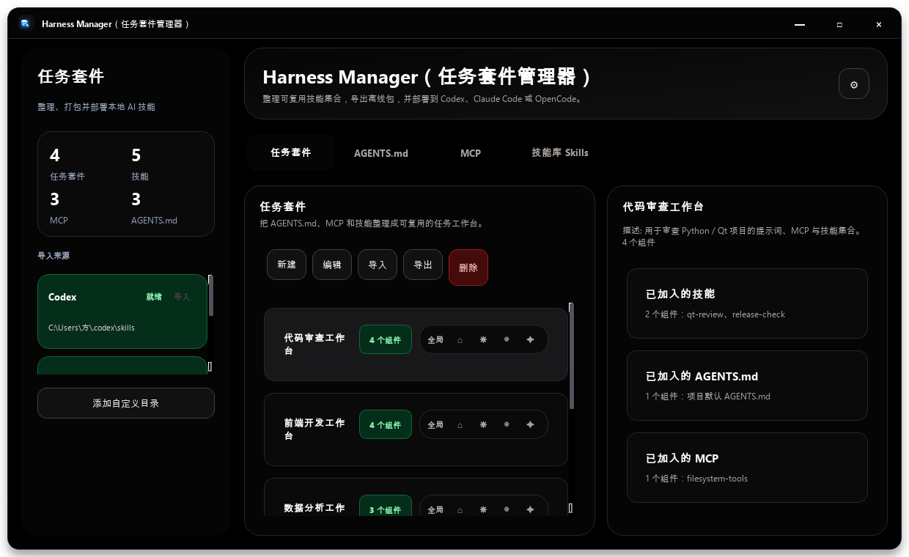
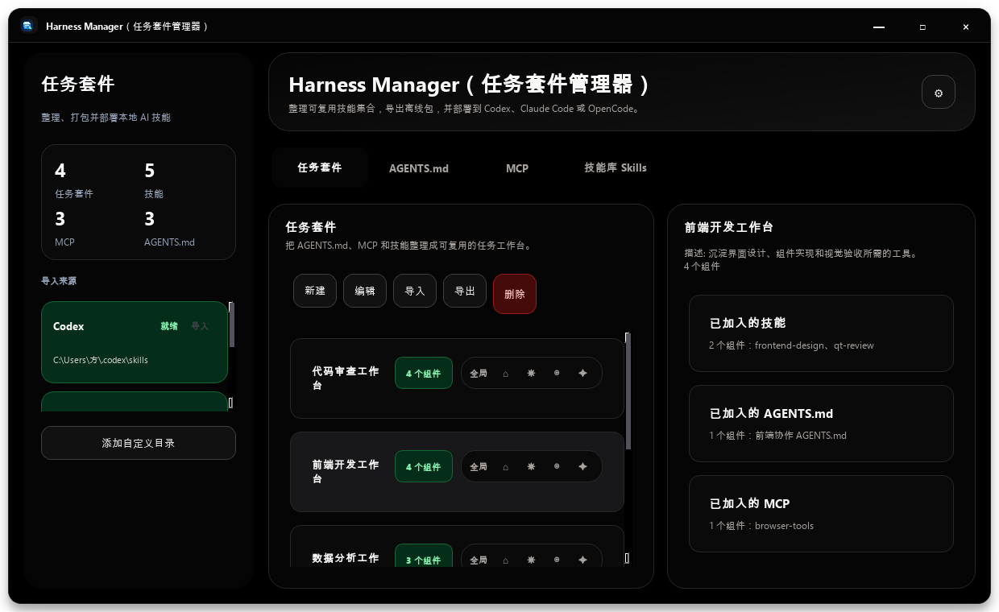
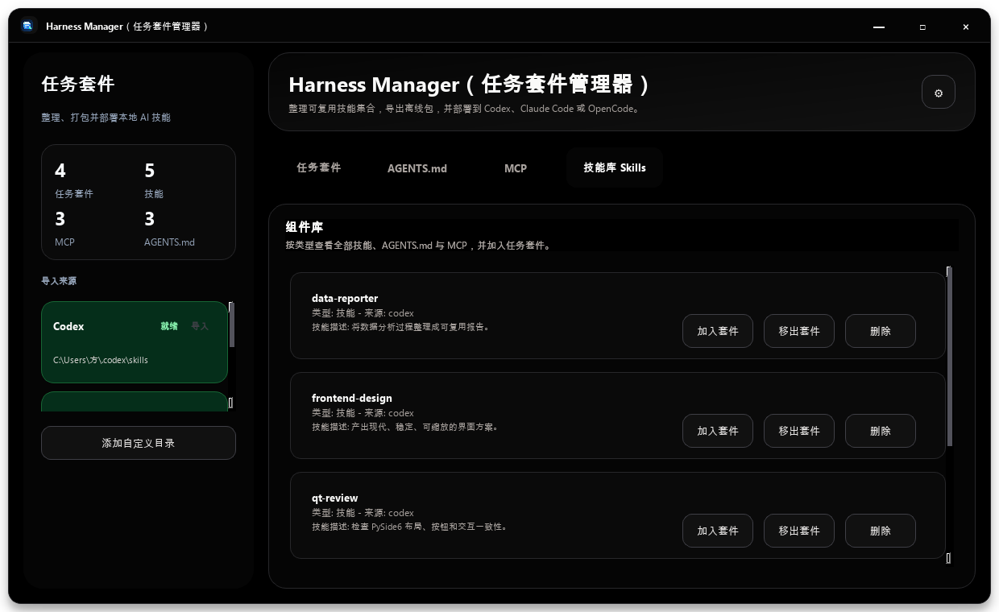
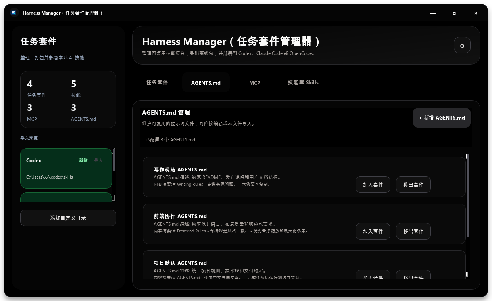
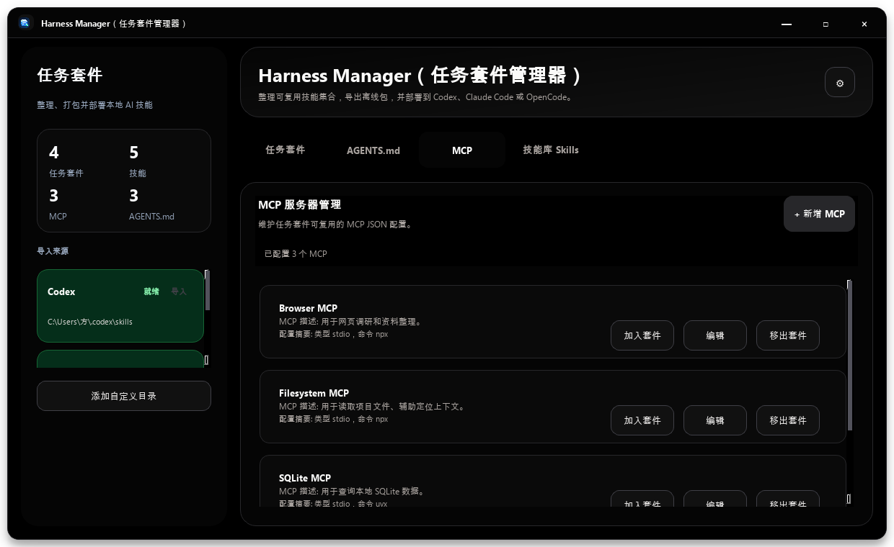
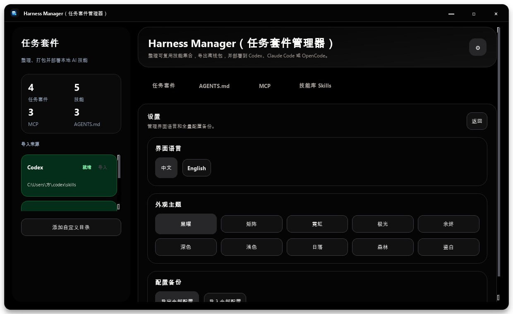

# Harness Manager（任务套件管理器）

Harness Manager 是一个本地 Windows 桌面应用，用来把完成某项任务需要的 `Skill`、`AGENTS.md` 和 MCP 配置整理成可复用的“任务套件”，并部署到 Codex、Claude Code 或 OpenCode。

适合这些场景：

- 多个 AI 编程工具之间复用同一套任务上下文。
- 为代码审查、前端开发、文档写作等任务维护不同工具集合。
- 把任务上下文打包成 `.harness.zip`，在不同机器或团队成员之间共享。

> Hook 暂不支持，因为各工具的 Hook 标准差异较大。



## 使用流程

```text
导入或新建组件 → 创建任务套件 → 加入组件 → 部署到目标工具 → 撤销或导出共享
```

### 1. 任务套件总览

查看多个任务套件、组件统计、导入来源和部署入口。


### 2. 查看套件详情

选中套件后，右侧按类型展示已加入的 Skill、AGENTS.md 和 MCP。



### 3. 管理 Skill

从 Codex、Claude Code、OpenCode 默认目录或自定义目录导入 Skill，并加入或移出任务套件。



### 4. 管理 AGENTS.md

直接新建或从文件导入 AGENTS.md。一个任务套件最多加入一个 AGENTS.md。



### 5. 管理 MCP

新增和编辑 MCP JSON 配置，并作为组件加入任务套件。



### 6. 设置与备份

支持中英文切换、主题切换、全量配置导入导出。



## 核心能力

- 任务套件：新建、编辑、删除、导入、导出。
- 组件库：管理 Skill、AGENTS.md、MCP。
- 部署：支持 Codex、Claude Code、OpenCode，支持全局目录和项目目录。
- 状态：已部署后再次点击可撤销；成功不弹窗，失败显示原因。
- 安全：撤销部署会校验 fingerprint，避免误删用户修改过的文件。
- 配置：支持语言、主题、全量配置导入导出。

## 快速开始

```powershell
python -m venv .venv
.\.venv\Scripts\Activate.ps1
python -m pip install -e .[dev]
python -m harness_manager
```

也可以使用安装后的命令：

```powershell
harness-manager
```

## 打包

```powershell
.\scripts\build.ps1
```

产物位置：

```text
dist/HarnessManager/HarnessManager.exe
```

建议把 `dist/HarnessManager/` 整个目录复制到有写权限的位置运行，例如：

```text
D:\Tools\HarnessManager\
```

应用会在运行目录下写入 `data/`、`assets/`、`skills/`、`exports/`、`config/`。

## 技术栈

- Python 3.11+
- PySide6 / Qt Widgets
- SQLite
- pytest
- PyInstaller

## 开发验证

```powershell
pytest -q
python -m compileall -q src tests
```

## 日志

通过环境变量设置日志等级：

```powershell
$env:HARNESS_MANAGER_LOG_LEVEL="DEBUG"
```

可选值：`DEBUG`、`INFO`、`ERROR`，默认 `INFO`。

## 许可证

本项目采用 MIT License，详见 `LICENSE`。

项目依赖 PySide6 / Qt for Python 等第三方组件，第三方组件遵循其各自许可证。
